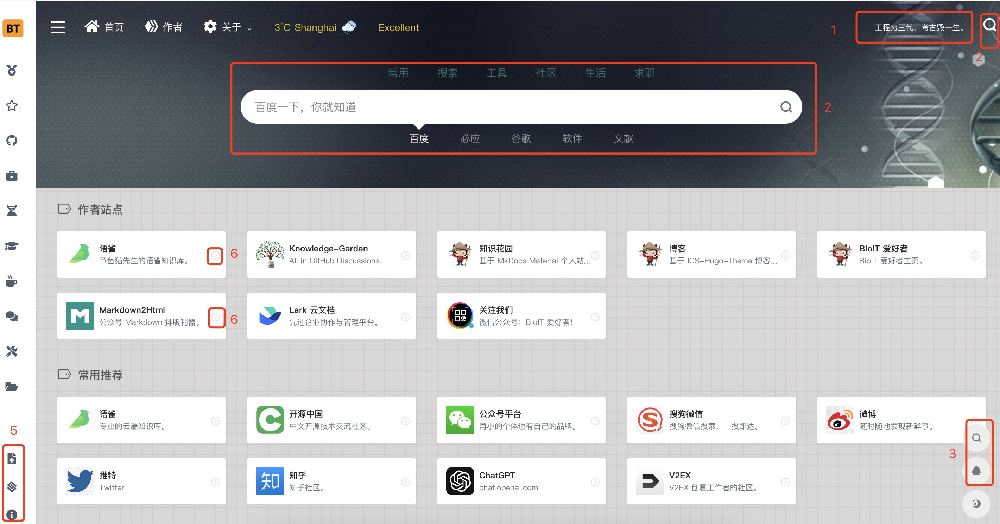
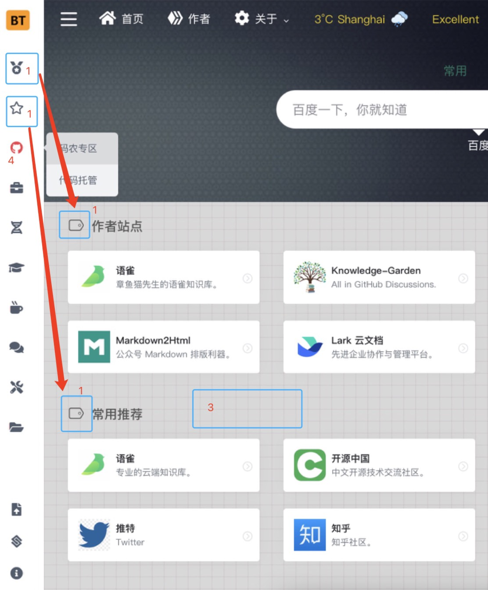
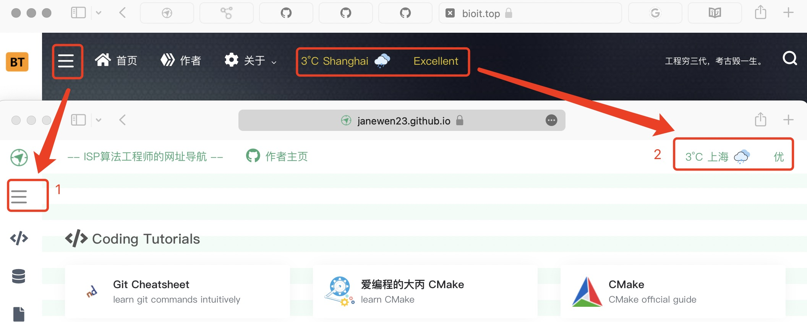

# My Navigator

这是基于开源框架 [WebStack](https://github.com/shenweiyan/WebStack-Hugo) 改造而成的网页, 是一个ISP开发相关的导航网页, 收录了一些权威网站、一些很好的教程网站和博客. ➡️(导航网页[点这里](https://janewen23.github.io/MyNavigator_Public/))⬅️

这个 repo, 除了README, 其他文件都是用 [Hugo](https://github.com/gohugoio/hugo) 生成的, 我直接编辑的代码**在本地**, **没有上传**. Hugo 生成的代码跟我本地的代码有些不一样.

相比于原版网页, 我修改(精简)了不少内容, 这里记录一下是怎么修改的, 一来怕自己忘掉, 二来可以给后来者做个参考.

由于我以前从未接触过 HTML/JavaScript/CSS, 以下内容写得不太专业, 请读者多多包涵.


## 关于目录结构

这里列出我修改过的文件(不包括图片)以及它们在目录中的位置, 和(我认为的)它们的作用:  
(再次说明, 这些文件**不是**这个repo里的, 是我本地的, 没上传)

config.toml  
|  
|-- data/  
|&nbsp; &nbsp; &nbsp; &nbsp;|-- 此目录下所有 .yml 文件  
|  
|-- themes/WebStack-Hugo/  
|&nbsp; &nbsp; &nbsp; &nbsp; &nbsp; &nbsp; &nbsp; &nbsp; &nbsp; &nbsp; &nbsp; &nbsp;|-- layouts/  
|&nbsp; &nbsp; &nbsp; &nbsp; &nbsp; &nbsp; &nbsp; &nbsp; &nbsp; &nbsp; &nbsp; &nbsp;| &nbsp; &nbsp; &nbsp; &nbsp;|-- index.html  
|&nbsp; &nbsp; &nbsp; &nbsp;&nbsp; &nbsp; &nbsp; &nbsp; &nbsp; &nbsp; &nbsp; &nbsp; | &nbsp; &nbsp; &nbsp; &nbsp;|-- partials/  
|&nbsp; &nbsp; &nbsp; &nbsp; &nbsp; &nbsp; &nbsp; &nbsp; &nbsp; &nbsp; &nbsp; &nbsp;| &nbsp; &nbsp; &nbsp; &nbsp; &nbsp; &nbsp; &nbsp; &nbsp;|--此目录下所有 .html 文件  
|&nbsp; &nbsp; &nbsp; &nbsp; &nbsp; &nbsp; &nbsp; &nbsp; &nbsp; &nbsp; &nbsp; &nbsp;|  
|&nbsp; &nbsp; &nbsp; &nbsp; &nbsp; &nbsp; &nbsp; &nbsp; &nbsp; &nbsp; &nbsp; &nbsp;|-- static/assets/  
|&nbsp; &nbsp; &nbsp; &nbsp; &nbsp; &nbsp; &nbsp; &nbsp; &nbsp; &nbsp; &nbsp; &nbsp;| &nbsp; &nbsp; &nbsp; &nbsp; &nbsp; &nbsp; &nbsp; &nbsp; |-- css/  
|&nbsp; &nbsp; &nbsp; &nbsp; &nbsp; &nbsp; &nbsp; &nbsp; &nbsp; &nbsp; &nbsp; &nbsp;| &nbsp; &nbsp; &nbsp; &nbsp; &nbsp; &nbsp; &nbsp; &nbsp; | &nbsp; &nbsp; &nbsp; &nbsp; |-- custom-style.css  
|&nbsp; &nbsp; &nbsp; &nbsp; &nbsp; &nbsp; &nbsp; &nbsp; &nbsp; &nbsp; &nbsp; &nbsp;| &nbsp; &nbsp; &nbsp; &nbsp; &nbsp; &nbsp; &nbsp; &nbsp; | &nbsp; &nbsp; &nbsp; &nbsp; |-- style-3.03029.1.css  
|&nbsp; &nbsp; &nbsp; &nbsp; &nbsp; &nbsp; &nbsp; &nbsp; &nbsp; &nbsp; &nbsp; &nbsp;| &nbsp; &nbsp; &nbsp; &nbsp; &nbsp; &nbsp; &nbsp; &nbsp; |  
|&nbsp; &nbsp; &nbsp; &nbsp; &nbsp; &nbsp; &nbsp; &nbsp; &nbsp; &nbsp; &nbsp; &nbsp;| &nbsp; &nbsp; &nbsp; &nbsp; &nbsp; &nbsp; &nbsp; &nbsp; |-- js /  
|&nbsp; &nbsp; &nbsp; &nbsp; &nbsp; &nbsp; &nbsp; &nbsp; &nbsp; &nbsp; &nbsp; &nbsp;| &nbsp; &nbsp; &nbsp; &nbsp; &nbsp; &nbsp; &nbsp; &nbsp; | &nbsp; &nbsp; &nbsp; &nbsp; |-- app-mini.js

作用:

- config.toml: 一些参数, 用来设置页面的 “控制选项” 之类的东西. 这些参数会被 html 文件调用, 也就是说这些参数会被传到 html 的代码中.

- data/ 中的 yml 文件: 也是参数, 用来定义页面主体的结构和内容; 也会被传到 html 的代码中.

- index.html: 列出了这个网页的组成部分, 每个部分都是 partials 里的一个文件. 最终由 Hugo 生成的 index.html 就是这些列出的文件拼成的.

- partials/ 中的 html 文件: 感觉这些是最重要的东西, 定义了每个 “组成部分” 都有哪些内容(文字和icon), 比如页面的主体, (叫做main), 那么 content_main 这个文件就定义了这几个内容: 导航的每个类别的名字, 每个类别里的每个 “卡片” 上的网站的 url, logo, 标题, 和简介.

- 两个 css 文件: 定义颜色和样式, 一次改好, 就能一劳永逸. 似乎 custom-style 可以覆盖 style-3.03029.1.

- app-mini.js: 主要负责页面的交互动作, 比如鼠标点击某个东西, 会发生什么. 其实没怎么改, 把很多无关项注释掉了, 可能不注释也能正常运行.

## 我是怎么改的

只要把代码中的名字跟具体的页面上的东西对应起来, 就能找对该改哪些代码. 好在这些代码的注释写得不错, 而且代码也都是一块一块的, 块之间也没有那么多耦合, 所以操作起来还算没啥风险.

### 首先注释掉不需要的东西


- 右上角的一言
  - 在 content_header.html 里, 注释很贴心地标出了开始和结束的地方.
- header 正中央的搜索引擎、右上角的搜索引擎: 
  - 有点忘了谁是谁了, 首先把 index.html 里面的 {{ partial "content_search.html" . }} 和 {{ partial "modal_search.html" . }} 注释掉 (就是说这两个文件根本不用看了), 然后在 content_header.html 里, 找 “search-modal” 字眼, 注释掉它所在的代码块.
- 右下角滑块的搜索引擎、QQ 图标: 
  - 在 content_footer.html 里, 比较好找. 
- 页面最下方的“长条卡片” 友情链接:
  - 好像失手删掉了, 记得好像在 content_footer.html 里,
- 左边 sidebar 里, 左下角的那三个东西:
  - 在 sidebar.html 里, 找 “网站提交” “友情链接” “关于导航” 字眼即可定位.
- 页面主体的每个网站卡片右侧的 “直达” 按钮:
  - 在 content_main.html 里, 找 “直达” 字眼即可定位. 至于为什么不需要, 是因为点击它, 会在当前页面打开链接, 但我总是想在新页面打开链接, 直接点卡片就行了.

### 然后改 icon, 字体大小, 颜色之类


- 页面主体的导航类别标题的 icon 与左边 sidebar 的 icon 保持一致 
  - 在 content_main.html 中找 “icon” 字眼(大概, 有点忘了), 改后是这样:
  
        <div class="d-flex flex-fill">
            <h4 class="text-gray text-lg mb-4">
                    <i class="{{ .icon }} fa-lg icon-fw" id="{{ md5 .taxonomy }}"></i>
                    {{ .taxonomy }}
            </h4>
        </div>
  - 其中的 {{ .icon}} 是从 yml 文件里传过来的, 将来 Hugo 会用实际的 icon 的值替换 {{ .icon}}.
  - icon 用的是 fontawesome 的, 列表和名字在这里找: https://fontawesome.com/v4/icons/  
  - 使用时, 代码的 fa 是 “solid 样式”, far 是 “regular 样式”, fab 是 “brands 样式” (举例, 想搞个 GitHub 图标, 代码为 fab fa-github); 
  - 新的语法和本网页正在用的版本不一样, 比如 fab 新的写法是 fa-brands.
- 全局字体大小
  - 在 custom-style.css 第1, 2行.
- 背景由灰格子改成绿白条
  - 在 custom-style.css 最后几行 “网格背景” 那块, 可以改颜色和格子线的粗细, 要横条的话把网格的第二个 “linear-gradient” 的宽度改成 0px.
- 鼠标悬浮时, 文字或 icon 变红色, 改成变绿色:
  - 这个在 custom-style.css 和 style-3.03029.1.css 里都有; 如果你的 IDE 可以在颜色的编号前面显示出那个颜色的话, 就可以很快看到代码里的红色. 找到那个红色的颜色编号, 然后全局替换成绿色, 如果不知道绿色啥编号, 可以随便找个红色的地方, 把那一处的颜色改一改, 反正有预览. 调好了再全局替换. 
  - 鼠标悬浮在 “网站卡片” 上时, 不想颜色变话, 在 style-3.03029.1.css 里找, “URL box style” 那块, 有个 “.url-card .url-body:hover”, 设置好颜色就行.


### 以及改一点布局


- “展开/收起左边栏” 的按钮挪进左边 sidebar 内
  - 这个按钮叫 “header-mini-btn”, 把它的代码块从 “content_header.html” 挪到 “sidebar.html” 就行, 目标位置的确定要看这些 icon 的顺序, 比如我需要它在 “网站类别” 的 icon 的上边, 那就放到 “网站类别” 那块代码的前方. 反正最后都会拼成一个文件, 变量啥的应该都是全局的.
- 天气组件挪到原来 “一言” 的位置
  - 方法同上. (Edit: 瞧瞧这一言, 多损呐)

### 最后是细节控才会注意的一些 refinements
- 去掉 Hugo 生成时的 “found no layout file for "html" for kind "taxonomy" ” 警告:
  - 在 _default/ 文件夹内新建一个名为 “taxonomy.html” 的空的文件即可.
- 站外链接在新页面打开:
  - header的链接会在当前页面打开; 网页最底下的链接也会在当前页面打开. 想改成在新页面打开, HTML语法为: 
    ```
    <a href="网址" target="_blank">链接显示的文字</a>
    ```
  - 有个问题是 markdown 似乎不支持在新的页面打开, 所以如果 toml 里写了一个 markdown 的带链接的东西, 传到 html 里, 它还是在原来的页面打开. 最终直接在 html 里把那个链接 “写死” 了, 不从toml 传递了.    
- 不要点击 logo 就刷新网页:
  - 为啥要改这个, 因为, 当你在深色模式下, 不小心点了一下 logo, 网页就刷新了, 而且还默认网页被打开时是亮色模式, 要亮瞎了. 我改得比较简单粗暴, 直接让 logo 就是一个图片, 把它周围的 `<a> </a>` 去掉了.
- 顶部 banner 宽度调整, 透明度、glow调整
  - 这没啥说的, css 里找. 纯属强迫症不改不舒服.
- 1/18/2024 新增: 让深色/浅色模式随系统自动切换
  - 这个功能 “主体部分” 是在 app.mini.js 里, 仅支持手动切换. 在网上查了 javascript 怎么自动切换, 还真有, 于是拿来改改就实现了.  
  - 网上的查方法是这样, 先调用 ```window.matchMedia((prefers-color-scheme: dark)")``` 获取系统的深浅色风格:
  ```js
  const darkModeQuery = window.matchMedia("(prefers-color-scheme: dark)");
  if (darkModeQuery.matches) {
      // 处于深色模式
      // do something
  } else {
      // 处于浅色模式
      //do something
  }
  ```

  - 然后 (接着上面的代码) 监听深/浅色的变化:
  
  ```js
  // 持续监听深色浅色模式的变化:
  darkModeQuery.addEventListener("change", (e) => {
      console.log(e.matches ? "深色模式" : "浅色模式");
      if (e.matches) {
          // 处于深色模式
          // do something
      } else {
          // 处于浅色模式
          // do something
      }
  });
  ```
  - 调试的时候可以像上面一样加一句 ```console.log()```, 在浏览器网页上右键打开源码, 那个界面有显示 console 输出的地方, 可以看到 log 的内容.
  - 现在改变电脑的系统主题时, 可以看到相应的 log, 说明这个代码实现了持续监听的功能. 我们还需要让网页根据监听结果切换深色/浅色模式. 通过研究原作者的代码, 发现切换深浅色, 实际起作用的代码就3行 (这几行代码来自 “footer.html”, 就是说切换深浅色功能的实现, 其实在 “footer.html” 也有一部分):

  ```js
  // 从深色变为浅色
  document.body.classList.remove('io-grey-mode'); // 把“浅色” 移出 classList
  document.body.classList.add('io-black-mode'); // 把 “深色” 放进 classList
  switch_mode(); // 把右下角的太阳月亮图标切换一下, 这是已经在别处写好的函数
  ```
  - 那么就在上面 “do something” 的位置填上这3行代码即可; 浅色变深色的交换一下remove() 和 add() 括号里的名字就行.


## 附上碎碎念笔记

Layout 里面的html文件都是template, 内容里面有{{ }} 括起来的都是 yml 文件相关的东西, 可以被带入相关的变量, 也可以实现if else end 之类的逻辑.

在 yml 里编辑的内容, 最终会被带入到 html 文件里. 最后用hugo -D 会生成public文件夹, 那里面的html文件才是最终的定稿, 是自动生成的, 网页的运行是基于此html, 不是带template的html.

举例:
{{ range .Site.Data.webstack }}

其中, .Site 就是这个网页的根目录的代称, 并不需要你的网页的文件夹叫做site; 然后, .Site.Data.webstack 说明yml文件是在 data (大小写不敏感)文件夹下, 文件名叫webstack, range说明是在这个文件范围内.

这个range 范围结束的地方有{{ end }}.

在 {{ end }} 之前, 如果有 {{ .taxonomy }}, 意思是 webstack 文件里面的一个一级标题叫做taxonomy,  {{ .taxonomy }} 将来会被 taxonomy 的具体标题内容替换. (就像 c 语言的宏定义)


根目录下的config.toml (或者 hugo.toml) 里面的内容对应 html 里的 $.Site.Params, 同理, {{ }} 括起来的都会被toml文件的相关内容替换. 比如:

{{ if $.Site.Params.defaultLogo }}

意思是判断如果 toml 里定义了 defaultLogo.


